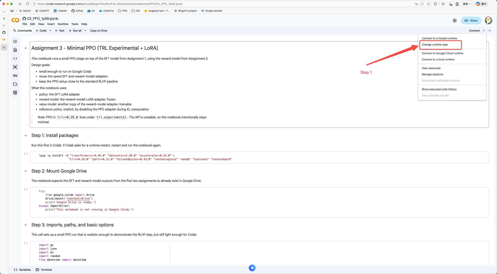
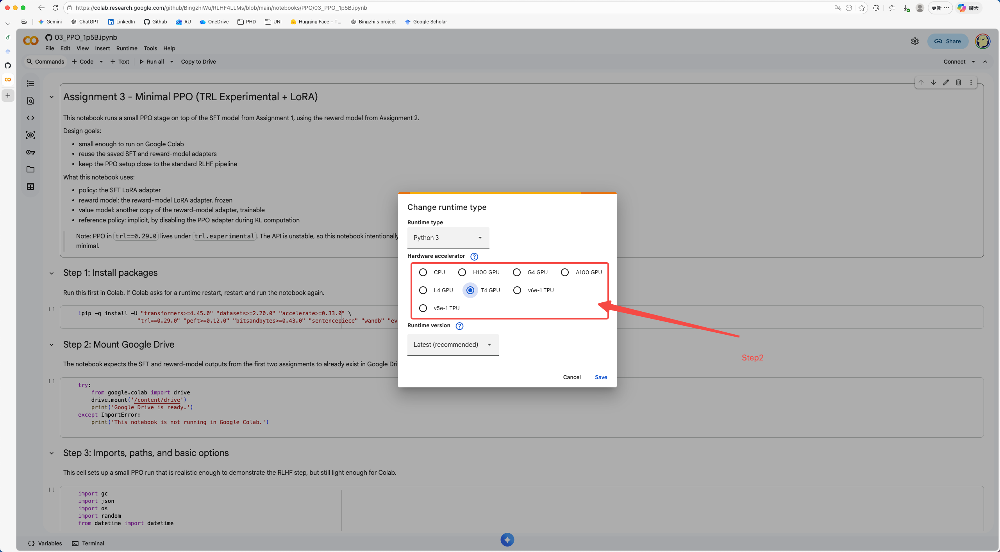
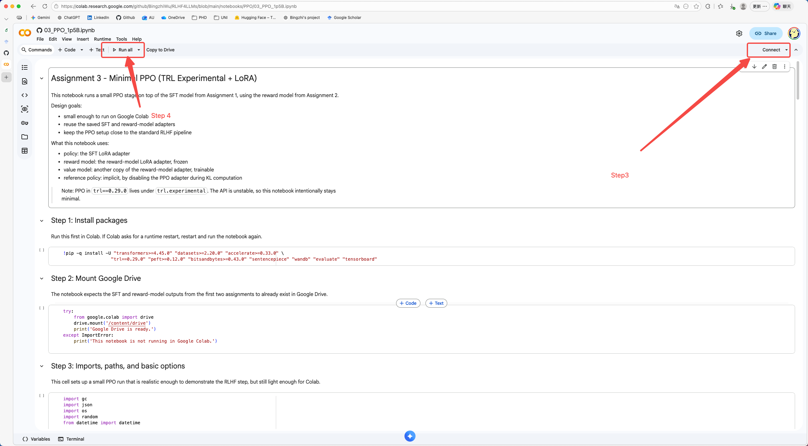
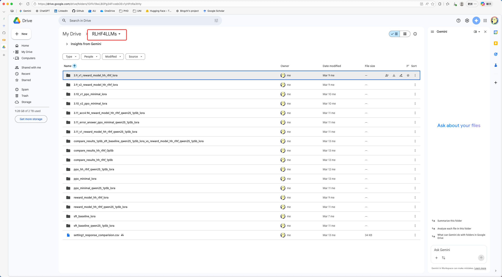
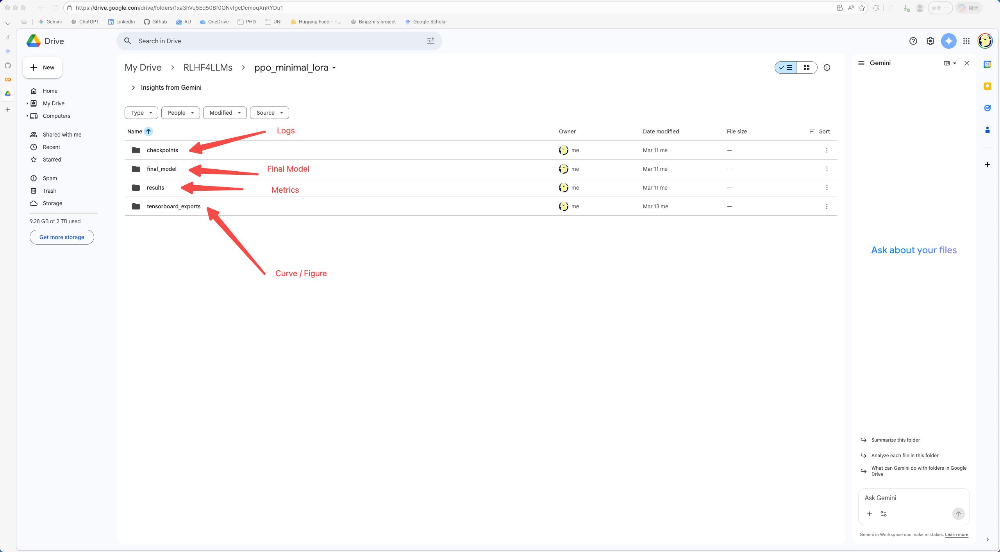

# RLHF4LLMs

Associated project paper: [Overleaf manuscript](https://www.overleaf.com/7793569333nsvdtsgrsdvh#92703f)

This repository is a reproducible RLHF coursework/experiment workspace covering the full pipeline from supervised fine-tuning (SFT), to reward modeling (RM), to PPO alignment, and finally cross-stage result comparison. 


The project is notebook-based and is intended to be run step by step in Google Colab.

## 1. Notebook Overview

The repository currently includes both 0.5B and 1.5B experiment tracks organized by stage:

| Notebook | Purpose | Default model/data |
|---|---|---|
| `notebooks/sft/01_SFT_Baseline.ipynb` | SFT baseline training | `Qwen/Qwen2.5-0.5B` + `tatsu-lab/alpaca` |
| `notebooks/sft/01_SFT_Baseline_1p5B.ipynb` | 1.5B SFT training | `Qwen/Qwen2.5-1.5B` + `tatsu-lab/alpaca` |
| `notebooks/reward_model/02_Reward_Model.ipynb` | HH-RLHF reward model | `Qwen/Qwen2.5-0.5B` + `Anthropic/hh-rlhf` |
| `notebooks/reward_model/02_Reward_Model_1p5B.ipynb` | 1.5B HH-RLHF reward model | `Qwen/Qwen2.5-1.5B` + `Anthropic/hh-rlhf` |
| `notebooks/PPO/03_PPO.ipynb` | PPO alignment training | Depends on 0.5B SFT + RM outputs |
| `notebooks/PPO/03_PPO_1p5B.ipynb` | 1.5B PPO alignment training | Depends on 1.5B SFT + RM outputs |
| `notebooks/PPO/03_PPO_HH_RLHF_1p5B.ipynb` | 1.5B PPO with HH-RLHF prompts | Depends on 1.5B SFT + RM outputs |
| `notebooks/analysis/04_Compare_Results_HH_RLHF.ipynb` | Unified comparison and export | Compares base / SFT / PPO |

## 2. Recommended Execution Order

### 0.5B main track

1. Run `01_SFT_Baseline.ipynb`
2. Run `02_Reward_Model.ipynb`
3. Run `03_PPO.ipynb`
4. Run `04_Compare_Results_HH_RLHF.ipynb`

### 1.5B main track

1. Run `01_SFT_Baseline_1p5B.ipynb`
2. Run `02_Reward_Model_1p5B.ipynb`
3. Run `03_PPO_1p5B.ipynb` or `03_PPO_HH_RLHF_1p5B.ipynb`
4. Run `04_Compare_Results_HH_RLHF.ipynb`

## 3. Models and Datasets

### Base models

- `Qwen/Qwen2.5-0.5B`
- `Qwen/Qwen2.5-1.5B`

### Datasets

- `tatsu-lab/alpaca`
- `Anthropic/hh-rlhf`


Notes:

- `Anthropic/hh-rlhf` may contain harmful, unsafe, or offensive content, which is normal for preference-learning benchmarks.
- The repository does not store dataset copies locally. Datasets are downloaded through Hugging Face `datasets`.

## 4. Environment Setup

### Open Google Colab in the browser

The recommended workflow for this project is to run the notebooks in Google Colab.

1. Open [Google Colab](https://colab.research.google.com/) in your browser.
2. Sign in with the Google account that has access to your Google Drive.
3. Choose one of the following ways to open the notebooks:
   - Upload the `.ipynb` files from this repository directly into Colab
   - Upload the repository to Google Drive first, then open the notebooks from Drive in Colab
4. When prompted, allow Colab to connect to Google Drive so saved models and results can persist across sessions.



### Runtime and performance guidance

When opening a notebook in Colab, enable a GPU runtime:

1. In Colab, open `Runtime` -> `Change runtime type`
2. Set `Hardware accelerator` to `GPU`
3. Save and reconnect the session



Practical recommendation:

- start with the 0.5B notebooks if your goal is to verify the pipeline quickly
- use the 1.5B notebooks only when you have enough runtime budget and GPU memory
- if Colab free-tier resources are unstable, rerun from the last completed saved stage rather than restarting the full pipeline

### Dependencies in Colab

The notebooks already contain package installation cells, so no manual environment setup is required before opening them in the browser.

If Colab asks for a runtime restart after installation, restart the runtime and continue running the notebook from the next required step.



## 5. Running the Project

### Google Colab

This project is recommended to run in Colab. The notebooks already include:

- Colab environment detection
- Google Drive mount logic
- Automatic output directory creation


This means:

- Each stage writes its training results to Google Drive
- When the notebooks are run in Colab, the saved models, checkpoints, logs, and result files are stored in Google Drive rather than only inside the temporary Colab session

After running notebooks, experiment directories such as the following will be created:

```text
sft_baseline_lora/
reward_model_hh_rlhf_lora/
ppo_minimal_lora/
sft_baseline_qwen25_1p5b_lora/
reward_model_hh_rlhf_qwen25_1p5b_lora/
ppo_minimal_qwen25_1p5b_lora/
ppo_hh_rlhf_qwen25_1p5b_lora/
compare_results_.../
```

Usually inside `/content/drive/MyDrive/RLHF4LLMs`.



Each model typically contain:

- `checkpoints/` save checkpoints of model during train process
- `final_model/` save final model
- `results/` save training metrics
- `tensorboard_exports/` save figures, which may need to run 04_Compare_Results_HH_RLHF.ipynb



## 6. Repository Structure

The repository currently follows a stage-based notebook layout:

```text
RLHF4LLMs/
├── README.md
├── requirements.txt
├── .gitignore
├── doc/
│   ├── Step1.png
│   ├── Step2.png
│   ├── Step3_4.png
│   ├── Result1.png
│   └── Result2.png
└── notebooks/
    ├── sft/
    │   ├── 01_SFT_Baseline.ipynb
    │   └── 01_SFT_Baseline_1p5B.ipynb
    ├── reward_model/
    │   ├── 02_Reward_Model.ipynb
    │   └── 02_Reward_Model_1p5B.ipynb
    ├── PPO/
    │   ├── 03_PPO.ipynb
    │   ├── 03_PPO_1p5B.ipynb
    │   └── 03_PPO_HH_RLHF_1p5B.ipynb
    └── analysis/
        └── 04_Compare_Results_HH_RLHF.ipynb
```

## 7. Cross-Platform Notes

This project is primarily intended to run in Google Colab.

In practice, that means the operating system matters much less than the ability to use a modern web browser and access Colab.

If a system can:

- open a browser
- access Google Colab
- connect to Google Drive

then it can be used to run this project workflow.

This makes the project broadly usable from:

- macOS
- Windows
- Linux
- ChromeOS
- other browser-capable systems

Because the main execution environment is Colab, local differences in Python setup, CUDA installation, and package compatibility are not the main concern for reproduction.

## 8. Current Boundaries

- The project is notebook-first, not a packaged Python module
- No dataset copies are bundled in the repository
- The workflow is documented for Colab-first execution and Google Drive-based storage
